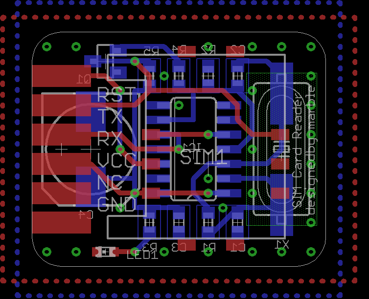
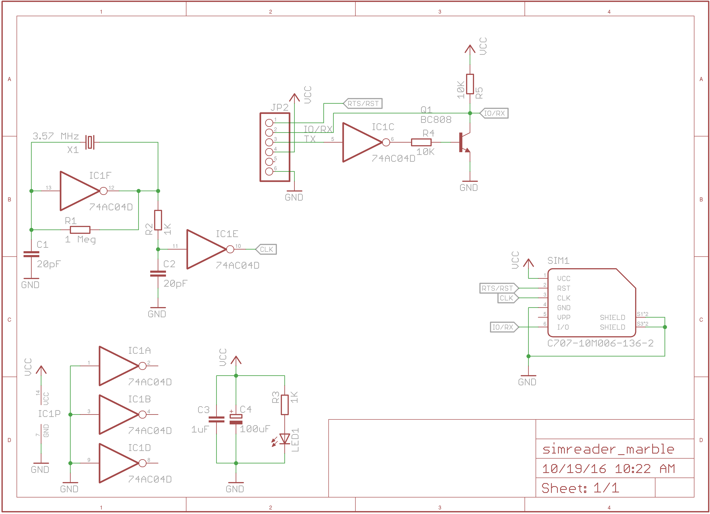

#Description
The board fullfills two tasks: Making the SIM card run by provind a clock and adapting the RX and TX signal of UART to the one I/O line of the SIM card.
The first is done byt connecting the in- and outputs of an inverter with a crystal that resonates with the desired frequency. This is stabilized by some passive components and then buffered by another inverter.
The adapting for the one way is simply done by connecting the I/O line of the SIM card to the RX of the USB-UART converter. For the other way, we pull up the I/O line by a resistor and connect the TX of the USB-UART converter through an inverter to a transistor, that can pull the line down (thereby the signal is double inverted).
Doing so, we prevent short circuiting that could occure if e.g. the SIM card pulls up and the USB-UART pulls down.
#Getting your own
I have the board uploaded to [OSH Park](https://oshpark.com/shared_projects/abhypSsD) if you want to order some.

|Part(s) |Value |
|---|---|
| C1, C2 | according to crystal (e.g. 15pF) |
| C3 | 1uF |
| C4 | 100uF |
| IC1 | 74AC04D |
| Q1 | NPN SOT23 BEC (e.g. MMBT2222A) |
| R1 | 1 Meg |
| R2, R3 | 1K |
| R4, R5 | 10K |
| SIM1| C707-10M006-136-2 |
| X1 | 3.57 MHz or 3.686 MHz|
